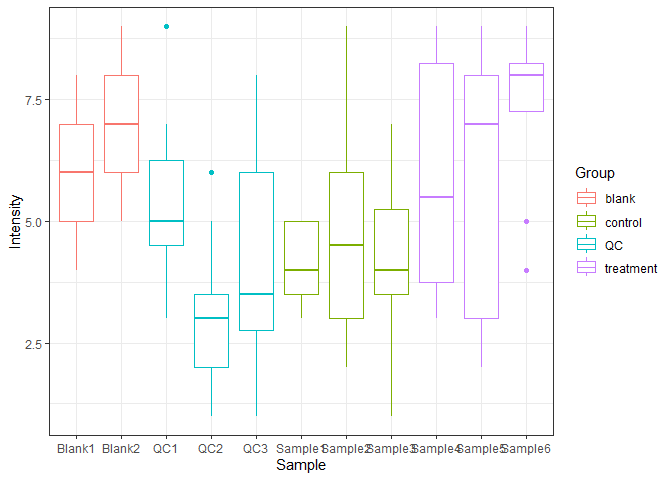
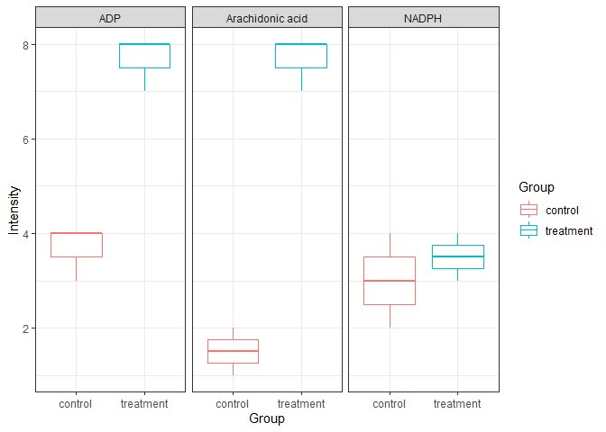

<!-- README.md is generated from README.Rmd. Please edit that file -->

# 🦋 metamorphr

<!-- badges: start -->
<!-- badges: end -->

metamorphr provides a set of wrapper functions to make working with
metabolomics data more fun. All data is stored in one
[tidy](https://cran.r-project.org/web/packages/tidyr/vignettes/tidy-data.html)
[tibble](https://tibble.tidyverse.org/) which facilitates integration
with [tidyverse](https://www.tidyverse.org/) packages like
[dplyr](https://dplyr.tidyverse.org/) and
[ggplot2](https://ggplot2.tidyverse.org/). Also, functions in metamorphr
are [pipe](https://magrittr.tidyverse.org/index.html)-friendly.

## Installation

You can install the development version of metamorphr from
[GitHub](https://github.com/) with:

``` r
# install.packages("pak")
pak::pak("yasche/metamorphr")
```

## Example

Easily plot the distribution of all intensities across samples

``` r
library(metamorphr)
library(dplyr)
#> 
#> Attaching package: 'dplyr'
#> The following objects are masked from 'package:stats':
#> 
#>     filter, lag
#> The following objects are masked from 'package:base':
#> 
#>     intersect, setdiff, setequal, union
library(ggplot2)

toy_metaboscape %>%
  dplyr::left_join(toy_metaboscape_metadata, by = "Sample") %>%
  ggplot2::ggplot(ggplot2::aes(Sample, Intensity, color = Group)) +
    ggplot2::geom_boxplot() +
    theme_bw()
```



… or compare the intensity of specific features across groups

``` r
toy_metaboscape %>%
  dplyr::left_join(toy_metaboscape_metadata, by = "Sample") %>%
  dplyr::filter(Name %in% c("Arachidonic acid", "ADP", "NADPH")) %>%
  dplyr::filter(Group %in% c("control", "treatment")) %>%
  ggplot2::ggplot(ggplot2::aes(Group, Intensity, color = Group)) +
    ggplot2::geom_boxplot() +
    ggplot2::facet_wrap(~Name) +
    ggplot2::theme_bw()
```


