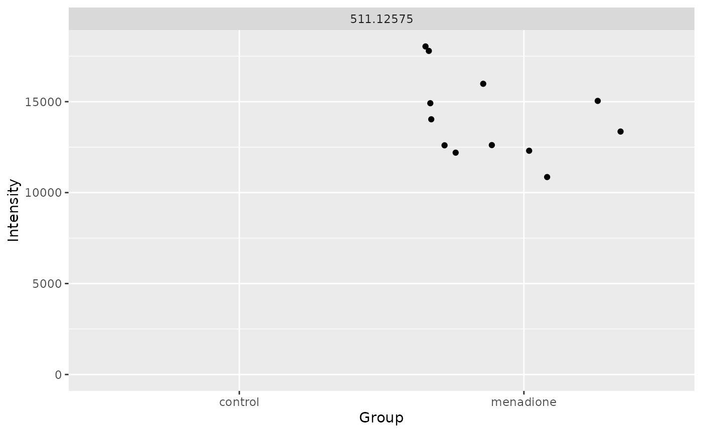
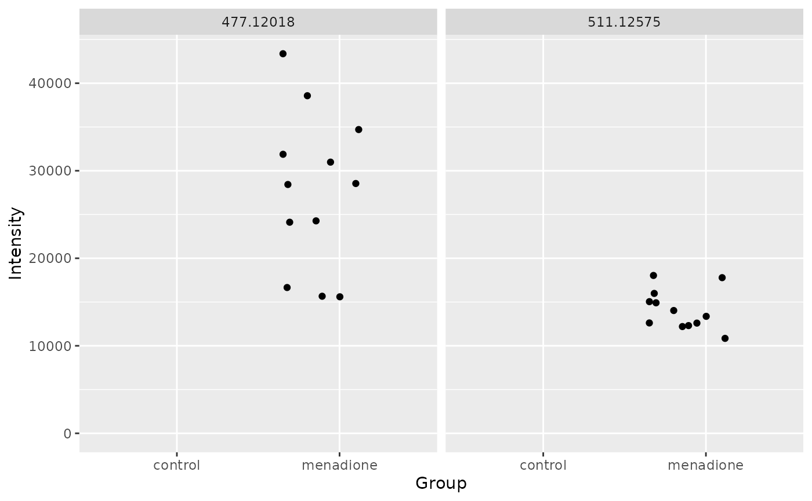

# Conjugate Screening

``` r
library(metamorphr)
```

This vignette explains how to use the metamorphr package to search a
featuretable for characteristic MS/MS fragments and neutral losses.

## Introduction

Glutathion (GSH) conjugates of xenobiotics usually result in
characteristic MS/MS fragments and neutral losses (Brink et al., 2014).
This vignette shows you two approaches, one relying on MS/MS fragments
and one relying on neutral losses, to screen a metabolomics data set
with associated MS/MS spectra for GSH conjugates. If you want to learn
more about drug metabolism you can visit the Wikipedia page
(<https://en.wikipedia.org/wiki/Drug_metabolism>). The data set was
obtained by treating HepG2 cells with the redox cycler menadione and
measuring the samples in ESI positive mode.

## Prepare the data set

This vignette uses data from a separate [GitHub
repository](https://github.com/yasche/metamorphr-data). More information
about the data can be found there.

First, the featuretable, the sample metadata, and the MS/MS spectra have
to be imported and joined together. The metamorphr package provides
several convenience functions to help with these tasks. To read the
sample metadata in the form of a .csv file,
[`readr::read_csv`](https://readr.tidyverse.org/reference/read_delim.html)
can be used.

``` r
menadione_ft <- read_featuretable(
  "https://github.com/yasche/metamorphr-data/raw/refs/heads/main/RP18/pos/MetaboScape/menadione/menadione.csv", 
  label_col = 3, 
  metadata_cols = 1:15)

menadione_metadata <- readr::read_csv(
  "https://github.com/yasche/metamorphr-data/raw/refs/heads/main/RP18/pos/MetaboScape/menadione/menadione_metadata.csv", 
  show_col_types = FALSE)

menadione_msn <- read_mgf("https://github.com/yasche/metamorphr-data/raw/refs/heads/main/RP18/pos/MetaboScape/menadione/menadione.gnps.mgf",
                          show_progress = F)
```

After the files have been imported successfully, they can be joined
together. First the sample metadata is joined using the convenience
function `join_metadata`. The MS/MS spectra can simply be added via
[`dplyr::left_join`](https://dplyr.tidyverse.org/reference/mutate-joins.html).

``` r
menadione_ft <- menadione_ft %>%
  join_metadata(menadione_metadata) %>%
  dplyr::left_join(menadione_msn, by = "FEATURE_ID")

head(menadione_ft)
#> # A tibble: 6 × 30
#>     UID Feature    Sample           Intensity FEATURE_ID    RT   CCS SIGMA_SCORE
#>   <int> <chr>      <chr>                <dbl>      <dbl> <dbl> <dbl>       <dbl>
#> 1     1 186.015    QC_1_07-Aug-24_…      745.          1  13.6  133.        NA  
#> 2     2 837.83232  QC_1_07-Aug-24_…     1256.          2  24.2  152.        NA  
#> 3     3 769.84306  QC_1_07-Aug-24_…     3594.          3  24.6  223.        NA  
#> 4     4 1403.71268 QC_1_07-Aug-24_…       NA           4  24.7  341.        NA  
#> 5     5 1539.68908 QC_1_07-Aug-24_…       NA           5  25    354.        NA  
#> 6     6 244.22612  QC_1_07-Aug-24_…    25572.          6  25.9  157.        12.9
#> # ℹ 22 more variables: NAME_METABOSCAPE <chr>, MOLECULAR_FORMULA <chr>,
#> #   ADDUCT <chr>, KEGG <chr>, CAS <chr>, MaxIntensity <dbl>,
#> #   Condition_QC_MeanIntensity <dbl>, Condition_BLANK_MeanIntensity <dbl>,
#> #   Condition_Control_MeanIntensity <dbl>,
#> #   Condition_Treatment_MeanIntensity <dbl>, Group <chr>, Replicate <dbl>,
#> #   Batch <dbl>, Factor <dbl>, SCANS <dbl>, PEPMASS <dbl>, MSLEVEL <dbl>,
#> #   CHARGE <chr>, POLARITY <chr>, RTINMINUTES <dbl>, ION <chr>, MSn <list>
```

## Find potential glutathion conjugates

To find potential GSH conjugates, two approaches can be used: (i) search
for specific MS/MS spectra and (ii) search for specific neutral losses.
Functions for both approaches are implemented in the metamorphr package
and are shown below. Results can be easily visualized using the
‘ggplot2’ package. Characteristic fragments and neutral losses are
described in Brink et al., 2014.

### Some initial filtering

To reduce the search space and remove potential false-positives, some
initial filtering can be done using one or more of the several filter
functions provided by the metamorphr package. First, QC samples are
removed using
[`dplyr::filter`](https://dplyr.tidyverse.org/reference/filter.html) as
they are not needed for further analysis. In this scenario, we are only
interested in features that are solely present in the treated samples,
so `filter_blank` can be used prior to searching for specific fragments
or neutral losses. Additionally, we are only interested in features that
are found reproducibly across samples, so we also use
`filter_grouped_mv`. Finally, blank samples are removed, again using
[`dplyr::filter`](https://dplyr.tidyverse.org/reference/filter.html).

``` r
menadione_ft <- menadione_ft %>%
  dplyr::filter(Group != "QC") %>%
  filter_grouped_mv(min_found = 0.75)  %>%
  filter_blank(blank_samples = c("blank", "control"),
               blank_as_group = T,
               group_column = Group,
               min_frac = 3) %>%
  dplyr::filter(Group != "blank")
```

### Characteristic MS/MS fragments

Searching for characteristic MS/MS fragments can be done using the
`filter_msn` function.

``` r
fragments <- c(308.0911,
               179.0485,
               177.0328,
               162.0219,
               130.0499)

menadione_ft %>%
  filter_msn(fragments = fragments, 
             min_found = 2, 
             tolerance = 5, 
             tolerance_type = "ppm", 
             show_progress = F) %>%
  ggplot2::ggplot(ggplot2::aes(Group, Intensity)) +
    ggplot2::geom_point(position = "jitter") +
    ggplot2::facet_wrap(~ Feature) +
    ggplot2::ylim(c(0, NA))
#> Warning: Removed 12 rows containing missing values or values outside the scale range
#> (`geom_point()`).
```



Searching for characteristic MS/MS fragments yields only one potential
GSH conjugate: A feature with an exact mass of 511.12575 Da.

### Characteristic neutral losses

Prior the searching for specific neutral losses via the
`filter_neutral_loss` function, neutral loss spectra must be calculated
using `calc_neutral_loss`. The usage of both functions is shown below.

``` r
losses <- c(75.0320,
            129.0426,
            232.0696,
            146.0692,
            249.0961,
            273.0961,
            275.1117,
            305.0682,
            307.0838)

menadione_ft %>%
  calc_neutral_loss(m_z_col = PEPMASS) %>%
  filter_neutral_loss(losses = losses, 
                      min_found = 4, 
                      tolerance = 10, 
                      tolerance_type = "ppm",
                      show_progress = F) %>%
  ggplot2::ggplot(ggplot2::aes(Group, Intensity)) +
    ggplot2::geom_point(position = "jitter") +
    ggplot2::facet_wrap(~ Feature) +
    ggplot2::ylim(c(0, NA))
#> Warning: Removed 24 rows containing missing values or values outside the scale range
#> (`geom_point()`).
```



This approach yields two potential GSH conjugates: One with an exact
mass of 477.12018 and the one with an exact mass of 511.12575 which was
also found using the MS/MS fragments-based approach above.

Interestingly, menadione has been reported to form a GSH conjugate,
thiodione, with a calculated exact mass of 477.12058 Da (Mauzeroll et
al., 2004). The difference between the measured exact mass of one
potential conjugate and the calculated mass is just 0.0004 Da or 0.86
ppm.

## References

Brink, A., Fontaine, F., Marschmann, M., Steinhuber, B., Cece, E. N.,
Zamora, I., & Pähler, A. (2014). Post-acquisition analysis of untargeted
accurate mass quadrupole time-of-flight MS E data for multiple
collision-induced neutral losses and fragment ions of glutathione
conjugates: Neutral losses and fragment ion analysis of glutathione
conjugates. *Rapid Communications in Mass Spectrometry, 28*(24),
2695–2703. DOI 10.1002/rcm.7062

Mauzeroll, J., Bard, A. J., Owhadian, O., & Monks, T. J. (2004).
Menadione metabolism to thiodione in hepatoblastoma by scanning
electrochemical microscopy. *Proceedings of the National Academy of
Sciences, 101*(51), 17582–17587. DOI 10.1073/pnas.0407613101
