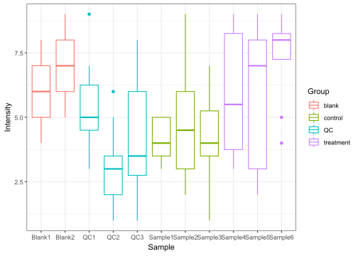
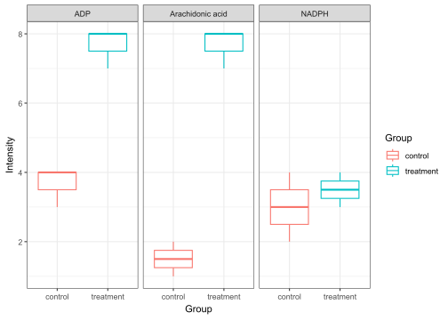

# metamorphr

## 💡 Overview

The metamorphr package is intended to make working with metabolomics
data more fun. For this, metamorphr introduces a
[tidy](https://cran.r-project.org/package=tidyr/vignettes/tidy-data.html)
data format which stores metabolomics data and associated metadata, as
well as MS/MS spectra in one [tibble](https://tibble.tidyverse.org/) and
includes a set of functions to facilitate tasks typically encountered
during metabolomics data analysis. This approach allows for an easy
integration with [Tidyverse](https://www.tidyverse.org/) packages,
including ggplot2 and dplyr.

## 💾 Installation

Install the stable version from CRAN with:

``` r
install.packages("metamorphr")
```

Alternatively, you can install the development version of metamorphr
from [GitHub](https://github.com/) with:

``` r
# install.packages("pak")
pak::pak("yasche/metamorphr")
```

## ⚙️ Functions

Here is an overview of currently implemented functions.


## 📑 Examples

### ✨ Create your analysis workflows in no time

``` r
library(metamorphr)
library(ggplot2)

toy_metaboscape %>%
  join_metadata(toy_metaboscape_metadata) %>%
  filter_blank(blank_samples = "blank",
               blank_as_group = T,
               group_column = Group) %>%
  filter_grouped_mv(min_found = 0.75) %>%
  impute_lod() %>%
  normalize_pqn() %>%
  scale_auto() %>%
  plot_pca(group_column = Group) +
    ggplot2::theme_bw()
```


### 📊 Seamlessly work with your data sets with dplyr and ggplot2

Easily plot the distribution of all intensities across samples

``` r
library(dplyr)

toy_metaboscape %>%
  join_metadata(toy_metaboscape_metadata) %>%
  ggplot2::ggplot(ggplot2::aes(Sample, Intensity, color = Group)) +
    ggplot2::geom_boxplot() +
    ggplot2::theme_bw()
```



… or compare the intensity of specific features across groups

``` r
toy_metaboscape %>%
  join_metadata(toy_metaboscape_metadata) %>%
  dplyr::filter(Name %in% c("Arachidonic acid", "ADP", "NADPH")) %>%
  dplyr::filter(Group %in% c("control", "treatment")) %>%
  ggplot2::ggplot(ggplot2::aes(Group, Intensity, color = Group)) +
    ggplot2::geom_boxplot() +
    ggplot2::facet_wrap(~Name) +
    ggplot2::theme_bw()
```


